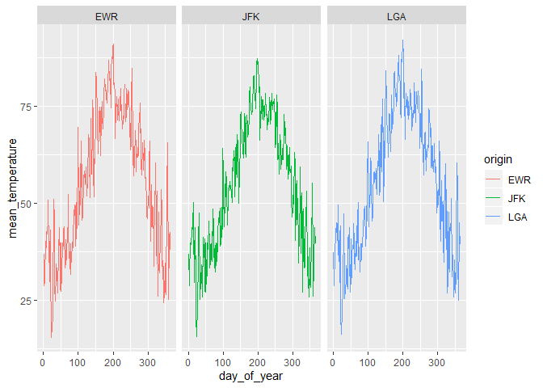

Practice Exam
=============

This practice exam asks you to do several code wrangling tasks that we
have done in class so far.

Clone this repo into Rstudio and fill in the necessary code. Then,
commit and push to github. Finally, turn in a link to canvas.

    ## -- Attaching packages ---------------------------------------------------- tidyverse 1.3.0 --

    ## √ ggplot2 3.2.1     √ purrr   0.3.3
    ## √ tibble  2.1.3     √ dplyr   0.8.3
    ## √ tidyr   1.0.0     √ stringr 1.4.0
    ## √ readr   1.3.1     √ forcats 0.4.0

    ## -- Conflicts ------------------------------------------------------- tidyverse_conflicts() --
    ## x dplyr::filter() masks stats::filter()
    ## x dplyr::lag()    masks stats::lag()

    ## Warning: package 'nycflights13' was built under R version 3.6.2

Make a plot with three facets, one for each airport in the weather data.
The x-axis should be the day of the year (1:365) and the y-axis should
be the mean temperature recorded on that day, at that airport.

    library(lubridate)

    ## 
    ## Attaching package: 'lubridate'

    ## The following object is masked from 'package:base':
    ## 
    ##     date

    new_weather <- weather %>% mutate(day_of_year = yday(time_hour))
    weather %>% mutate(day_of_year = yday(time_hour)) %>%
      group_by(day_of_year, origin) %>%
      summarise(mean_temperature = mean(temp)) %>%
      #left_join(new_weather) %>%
      ggplot(aes(x = day_of_year, y = mean_temperature, color = origin)) +
      geom_line() +
      facet_grid(~origin)

Make a non-tidy matrix of that data where each row is an airport and
each column is a day of the year.

    weather %>% mutate(day_of_year = yday(time_hour)) %>%
      group_by(day_of_year, origin) %>%
      summarise(mean_temperature = mean(temp)) %>%
      pivot_wider(names_from = day_of_year, values_from = mean_temperature)

    ## # A tibble: 3 x 365
    ##   origin   `1`   `2`   `3`   `4`   `5`   `6`   `7`   `8`   `9`  `10`  `11`  `12`
    ##   <chr>  <dbl> <dbl> <dbl> <dbl> <dbl> <dbl> <dbl> <dbl> <dbl> <dbl> <dbl> <dbl>
    ## 1 EWR     36.8  28.7  29.6  34.3  36.6  39.9  40.3  38.6  42.1  43.6  42.0  46.0
    ## 2 JFK     36.9  28.6  30.1  34.7  36.8  39.3  40.1  39.4  42.7  43.6  41.3  45.0
    ## 3 LGA     37.2  28.8  30.3  35.8  38.3  41.0  41.4  42.3  44.9  44.3  40.3  43.9
    ## # ... with 352 more variables: `13` <dbl>, `14` <dbl>, `15` <dbl>, `16` <dbl>,
    ## #   `17` <dbl>, `18` <dbl>, `19` <dbl>, `20` <dbl>, `21` <dbl>, `22` <dbl>,
    ## #   `23` <dbl>, `24` <dbl>, `25` <dbl>, `26` <dbl>, `27` <dbl>, `28` <dbl>,
    ## #   `29` <dbl>, `30` <dbl>, `31` <dbl>, `32` <dbl>, `33` <dbl>, `34` <dbl>,
    ## #   `35` <dbl>, `36` <dbl>, `37` <dbl>, `38` <dbl>, `39` <dbl>, `40` <dbl>,
    ## #   `41` <dbl>, `42` <dbl>, `43` <dbl>, `44` <dbl>, `45` <dbl>, `46` <dbl>,
    ## #   `47` <dbl>, `48` <dbl>, `49` <dbl>, `50` <dbl>, `51` <dbl>, `52` <dbl>,
    ## #   `53` <dbl>, `54` <dbl>, `55` <dbl>, `56` <dbl>, `57` <dbl>, `58` <dbl>,
    ## #   `59` <dbl>, `60` <dbl>, `61` <dbl>, `62` <dbl>, `63` <dbl>, `64` <dbl>,
    ## #   `65` <dbl>, `66` <dbl>, `67` <dbl>, `68` <dbl>, `69` <dbl>, `70` <dbl>,
    ## #   `71` <dbl>, `72` <dbl>, `73` <dbl>, `74` <dbl>, `75` <dbl>, `76` <dbl>,
    ## #   `77` <dbl>, `78` <dbl>, `79` <dbl>, `80` <dbl>, `81` <dbl>, `82` <dbl>,
    ## #   `83` <dbl>, `84` <dbl>, `85` <dbl>, `86` <dbl>, `87` <dbl>, `88` <dbl>,
    ## #   `89` <dbl>, `90` <dbl>, `91` <dbl>, `92` <dbl>, `93` <dbl>, `94` <dbl>,
    ## #   `95` <dbl>, `96` <dbl>, `97` <dbl>, `98` <dbl>, `99` <dbl>, `100` <dbl>,
    ## #   `101` <dbl>, `102` <dbl>, `103` <dbl>, `104` <dbl>, `105` <dbl>,
    ## #   `106` <dbl>, `107` <dbl>, `108` <dbl>, `109` <dbl>, `110` <dbl>,
    ## #   `111` <dbl>, `112` <dbl>, ...

    #new_weather %>%
     # pivot_wider(names_from = day_of_year, values_from = origin)

    ?pivot_wider

    ## starting httpd help server ... done

For each (airport, day) contruct a tidy data set of the airport’s
“performance” as the proportion of flights that departed less than an
hour late.

    weather

    ## # A tibble: 26,115 x 15
    ##    origin  year month   day  hour  temp  dewp humid wind_dir wind_speed
    ##    <chr>  <int> <int> <int> <int> <dbl> <dbl> <dbl>    <dbl>      <dbl>
    ##  1 EWR     2013     1     1     1  39.0  26.1  59.4      270      10.4 
    ##  2 EWR     2013     1     1     2  39.0  27.0  61.6      250       8.06
    ##  3 EWR     2013     1     1     3  39.0  28.0  64.4      240      11.5 
    ##  4 EWR     2013     1     1     4  39.9  28.0  62.2      250      12.7 
    ##  5 EWR     2013     1     1     5  39.0  28.0  64.4      260      12.7 
    ##  6 EWR     2013     1     1     6  37.9  28.0  67.2      240      11.5 
    ##  7 EWR     2013     1     1     7  39.0  28.0  64.4      240      15.0 
    ##  8 EWR     2013     1     1     8  39.9  28.0  62.2      250      10.4 
    ##  9 EWR     2013     1     1     9  39.9  28.0  62.2      260      15.0 
    ## 10 EWR     2013     1     1    10  41    28.0  59.6      260      13.8 
    ## # ... with 26,105 more rows, and 5 more variables: wind_gust <dbl>,
    ## #   precip <dbl>, pressure <dbl>, visib <dbl>, time_hour <dttm>

    performance <- flights %>%
      mutate(date = ymd(paste(year,"-", month,"-" ,day))) %>%
      mutate(dep_late = dep_delay >=60) %>%
      group_by(origin, date) %>%
      summarise(proportion = mean(dep_late, na.rm = TRUE))

Construct a tidy data set to that give weather summaries for each
(airport, day). Use the total precipitation, minimum visibility, maximum
wind\_gust, and average wind\_speed.

    weather_summary <- new_weather %>%
      group_by(origin, day_of_year) %>%
      summarise(total_prec = sum(precip), min_vis = min(visib), max_wind = max(wind_gust, na.rm = TRUE), avg_wind_speed = mean(wind_speed, na.rm = TRUE))

    table(new_weather$origin)

    ## 
    ##  EWR  JFK  LGA 
    ## 8703 8706 8706

Construct a linear model to predict the performance of each
(airport,day) using the weather summaries and a “fixed effect” for each
airport. Display the summaries.

    combined <- performance %>%
      mutate(day_of_year = yday(date)) %>%
      inner_join(weather_summary)

    ## Joining, by = c("origin", "day_of_year")

    combined

    ## # A tibble: 1,092 x 8
    ## # Groups:   origin [3]
    ##    origin date       proportion day_of_year total_prec min_vis max_wind
    ##    <chr>  <date>          <dbl>       <dbl>      <dbl>   <dbl>    <dbl>
    ##  1 EWR    2013-01-01     0.0822           1          0      10     26.5
    ##  2 EWR    2013-01-02     0.163            2          0      10     26.5
    ##  3 EWR    2013-01-03     0.0210           3          0      10   -Inf  
    ##  4 EWR    2013-01-04     0.0653           4          0      10     31.1
    ##  5 EWR    2013-01-05     0.0338           5          0      10     26.5
    ##  6 EWR    2013-01-06     0.05             6          0       6     19.6
    ##  7 EWR    2013-01-07     0.0789           7          0      10     24.2
    ##  8 EWR    2013-01-08     0.0181           8          0       8     25.3
    ##  9 EWR    2013-01-09     0.0239           9          0       6     20.7
    ## 10 EWR    2013-01-10     0.0204          10          0      10     26.5
    ## # ... with 1,082 more rows, and 1 more variable: avg_wind_speed <dbl>

    predict <- lm(proportion ~ origin + total_prec + min_vis + avg_wind_speed, data = combined)
    summary(predict)

    ## 
    ## Call:
    ## lm(formula = proportion ~ origin + total_prec + min_vis + avg_wind_speed, 
    ##     data = combined)
    ## 
    ## Residuals:
    ##      Min       1Q   Median       3Q      Max 
    ## -0.18800 -0.03704 -0.01755  0.01734  0.45572 
    ## 
    ## Coefficients:
    ##                  Estimate Std. Error t value Pr(>|t|)    
    ## (Intercept)     0.1394790  0.0082091  16.991  < 2e-16 ***
    ## originJFK      -0.0200180  0.0052986  -3.778 0.000167 ***
    ## originLGA      -0.0209328  0.0052113  -4.017 6.31e-05 ***
    ## total_prec      0.0531217  0.0077869   6.822 1.49e-11 ***
    ## min_vis        -0.0081510  0.0006977 -11.682  < 2e-16 ***
    ## avg_wind_speed  0.0010823  0.0005174   2.092 0.036684 *  
    ## ---
    ## Signif. codes:  0 '***' 0.001 '**' 0.01 '*' 0.05 '.' 0.1 ' ' 1
    ## 
    ## Residual standard error: 0.0698 on 1086 degrees of freedom
    ## Multiple R-squared:  0.2532, Adjusted R-squared:  0.2498 
    ## F-statistic: 73.65 on 5 and 1086 DF,  p-value: < 2.2e-16

Repeat the above, but only for EWR. Obviously, exclude the fixed effect
for each airport.

    EWR <- combined %>%
      filter(origin == "EWR")
    EWR_predict <- lm(proportion ~  total_prec + min_vis + avg_wind_speed, data = EWR)
    summary(EWR_predict)

    ## 
    ## Call:
    ## lm(formula = proportion ~ total_prec + min_vis + avg_wind_speed, 
    ##     data = EWR)
    ## 
    ## Residuals:
    ##      Min       1Q   Median       3Q      Max 
    ## -0.18642 -0.04566 -0.02363  0.03119  0.32733 
    ## 
    ## Coefficients:
    ##                  Estimate Std. Error t value Pr(>|t|)    
    ## (Intercept)     0.1341130  0.0134506   9.971  < 2e-16 ***
    ## total_prec      0.0512542  0.0133869   3.829 0.000152 ***
    ## min_vis        -0.0086600  0.0013316  -6.504 2.62e-10 ***
    ## avg_wind_speed  0.0020805  0.0008928   2.330 0.020341 *  
    ## ---
    ## Signif. codes:  0 '***' 0.001 '**' 0.01 '*' 0.05 '.' 0.1 ' ' 1
    ## 
    ## Residual standard error: 0.07406 on 360 degrees of freedom
    ## Multiple R-squared:  0.2366, Adjusted R-squared:  0.2302 
    ## F-statistic: 37.19 on 3 and 360 DF,  p-value: < 2.2e-16
